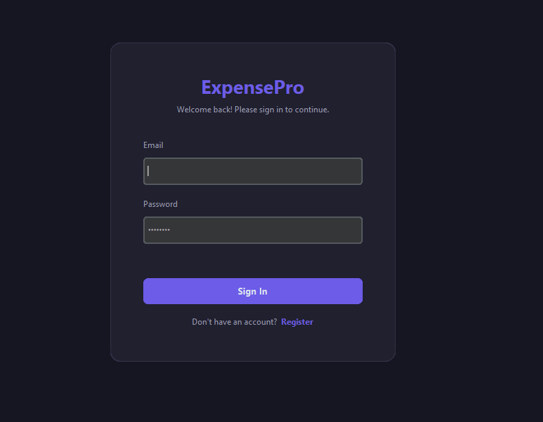
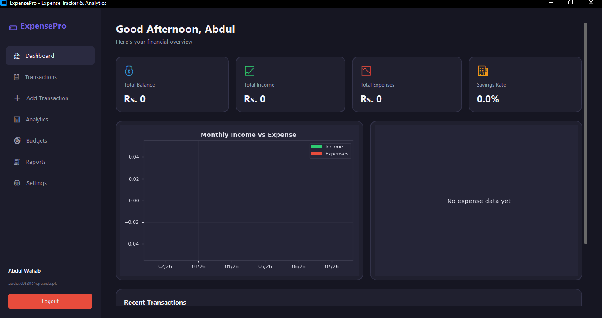
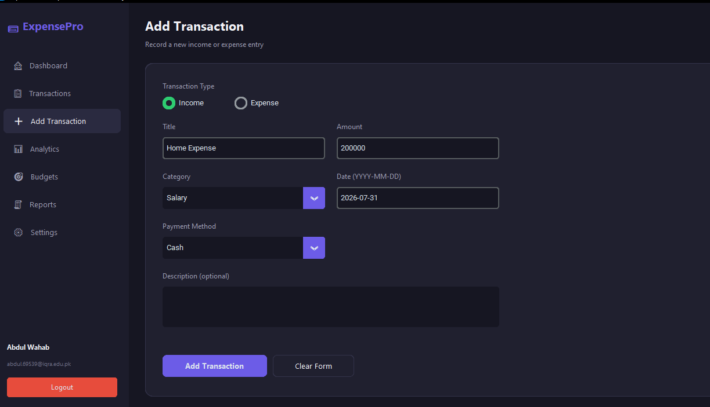
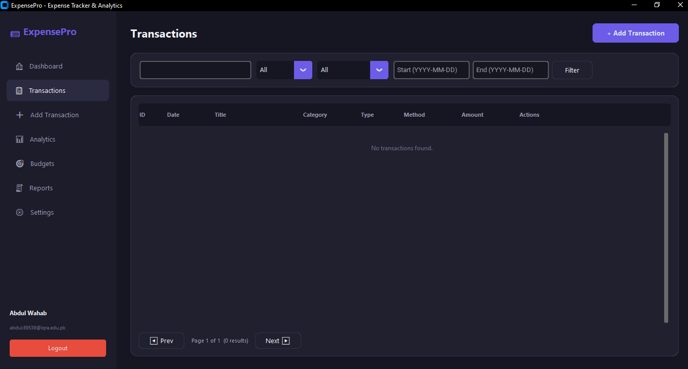
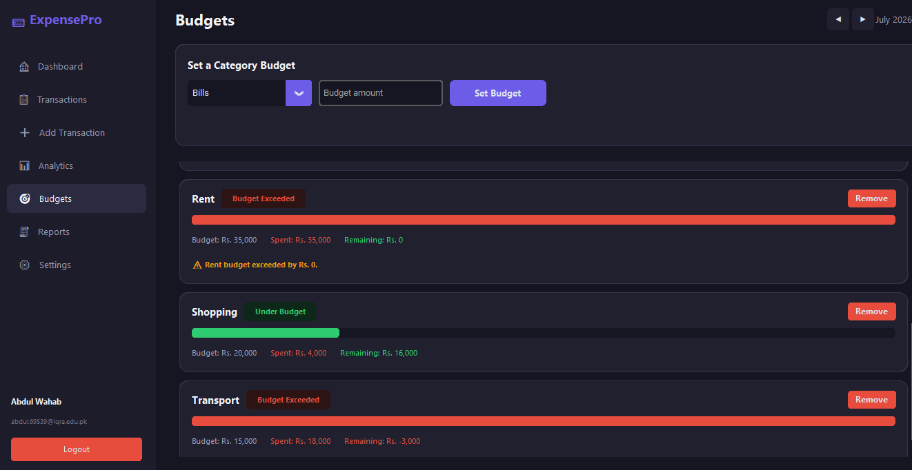
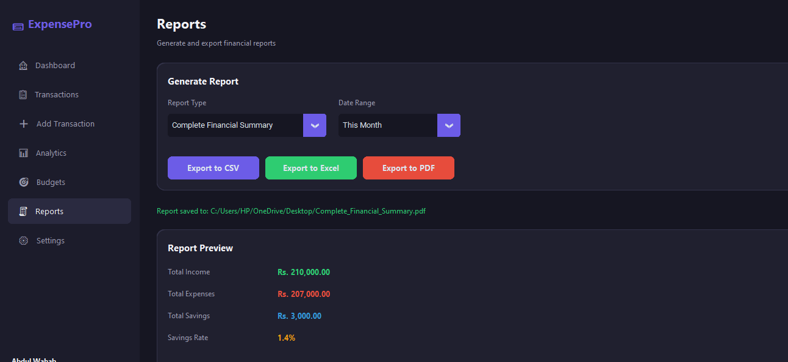

# 💳 ExpensePro — Expense Tracker & Analytics

A professional, full-featured desktop application for personal finance management, built with Python. ExpensePro combines a modern dark-themed dashboard UI with real analytics, budget tracking, and multi-format financial reporting — designed as a portfolio-grade project.


---

## 📖 Project Overview

ExpensePro is a desktop finance management application that lets users track income and expenses, set category budgets, visualize spending patterns, and export professional financial reports. It's built with a clean, layered architecture (UI → Services → Database) so the codebase stays maintainable and testable — no business logic lives inside the UI layer.

Each user has their own account with hashed credentials, and all financial data is scoped per-user in a local SQLite database.

---

## ✨ Features

### Authentication
- Secure registration and login
- Passwords hashed with PBKDF2-HMAC-SHA256 + per-user salt (never stored in plain text)
- Each user only sees their own transactions and budgets

### Dashboard
- Personalized greeting based on time of day
- Four live summary cards: Total Balance, Total Income, Total Expenses, Savings Rate
- Monthly Income vs. Expense bar chart
- Expense-by-category donut chart
- Recent transactions feed with a "View All" shortcut

### Transactions
- Full CRUD (create, read, update, delete) with confirmation on delete
- Live search by title/description
- Filter by type (Income/Expense), category, and custom date range
- Paginated table view

### Add / Edit Transaction
- Clean validated form (type, title, amount, category, date, payment method, description)
- Rejects empty titles, non-numeric or non-positive amounts, and invalid dates
- Reused for both creating and editing transactions

### Analytics
- Date range presets: This Week / This Month / Last Month / This Year / Custom Range
- Metric cards: Total Income, Expenses, Savings, Average Daily Expense, Highest Expense, Top Spending Category
- Five charts: Monthly Expense Trend, Monthly Income vs Expense, Category-wise Expenses, Payment Method Analysis, Daily Spending Trend
- All charts and cards recompute live from the SQLite database via Pandas — nothing is hardcoded

### Budgets
- Set a monthly budget per category
- Visual progress bars with status badges: Under Budget / Near Limit / Budget Exceeded
- Automatic overspend warnings (e.g. "Food budget exceeded by Rs. 5,000")
- Month-by-month navigation

### Reports
- Report types: Complete Financial Summary, Monthly Expense Report, Monthly Income Report, Category-wise Expense Report
- Export to **CSV** (Pandas), **Excel** (openpyxl, styled with headers/borders/colors), and **PDF** (ReportLab, with title, date range, totals, category summary, and full transaction table)
- Live preview of totals before exporting

### Settings
- Profile info, currency selection (PKR default), theme preference, notification toggle

---

## 🛠️ Technologies Used

| Purpose            | Library         |
|---------------------|-----------------|
| GUI                 | CustomTkinter   |
| Database            | SQLite3 (stdlib)|
| Data analysis       | Pandas          |
| Charts              | Matplotlib      |
| Excel export        | openpyxl        |
| PDF export          | ReportLab       |
| Password hashing    | hashlib (PBKDF2)|

---
## 📸 Screenshots

### Login


### Dashboard


### Add Transaction


### Transactions


### Analytics


### Budgets


### Reports


## ⚙️ Installation

**Requirements:** Python 3.10 or newer.

1. Clone the repository:
   ```bash
   git clone https://github.com/yourusername/expense-tracker.git
   cd expense-tracker
   ```

2. (Recommended) Create a virtual environment:
   ```bash
   python3 -m venv venv
   source venv/bin/activate      # Windows: venv\Scripts\activate
   ```

3. Install dependencies:
   ```bash
   pip install -r requirements.txt
   ```

   > Note: `tkinter` ships with most Python installations. On Linux, if it's missing:
   > `sudo apt-get install python3-tk`

---

## ▶️ How to Run

```bash
python main.py
```

On first launch, the SQLite database (`data/expense_tracker.db`) and default categories are created automatically. Register a new account, log in, and start tracking.

---

## 🗄️ Database Structure

**users**
| Column | Type | Notes |
|---|---|---|
| id | INTEGER PK | |
| full_name | TEXT | |
| email | TEXT | UNIQUE |
| password_hash | TEXT | PBKDF2-HMAC-SHA256 |
| salt | TEXT | per-user random salt |
| currency | TEXT | default `PKR` |
| theme | TEXT | default `dark` |
| notifications_enabled | INTEGER | |
| created_at | TEXT | |

**transactions**
| Column | Type | Notes |
|---|---|---|
| id | INTEGER PK | |
| user_id | INTEGER | FK → users.id |
| type | TEXT | `Income` or `Expense` |
| title | TEXT | |
| amount | REAL | > 0 |
| category | TEXT | |
| date | TEXT | ISO `YYYY-MM-DD` |
| payment_method | TEXT | |
| description | TEXT | |
| created_at | TEXT | |

**budgets**
| Column | Type | Notes |
|---|---|---|
| id | INTEGER PK | |
| user_id | INTEGER | FK → users.id |
| category | TEXT | |
| amount | REAL | |
| month | INTEGER | |
| year | INTEGER | |

**categories**
| Column | Type | Notes |
|---|---|---|
| id | INTEGER PK | |
| name | TEXT | UNIQUE |
| type | TEXT | `income` or `expense` |

---

## 🏗️ Project Architecture

```
expense_tracker/
│
├── main.py                    # Entry point, handles login/register/app-shell transitions
│
├── database/
│   ├── database.py            # Connection manager, singleton db instance
│   └── schema.py               # SQL table definitions + default categories
│
├── models/
│   ├── user.py                 # User dataclass
│   ├── transaction.py          # Transaction dataclass
│   └── budget.py                # Budget dataclass
│
├── services/                   # All business logic — no SQL or UI code mixed in
│   ├── auth_service.py          # Registration, login, password hashing
│   ├── transaction_service.py   # Transaction CRUD + validation
│   ├── budget_service.py        # Budget CRUD + spend-vs-budget status
│   └── analytics_service.py     # Pandas-powered analytics functions
│
├── ui/
│   ├── theme.py                 # Shared color palette & fonts
│   ├── widgets.py                # Reusable cards, buttons, dialogs, toasts
│   ├── login.py / register.py   # Auth screens
│   ├── app_shell.py              # Sidebar + content area + screen routing
│   ├── dashboard.py               # Dashboard screen
│   ├── transactions.py            # Transaction list/search/filter screen
│   ├── add_transaction.py         # Add/Edit form screen
│   ├── analytics.py                # Analytics dashboard screen
│   ├── budgets.py                   # Budget management screen
│   ├── reports.py                    # Report generation/export screen
│   └── settings.py                    # User settings screen
│
├── charts/
│   └── chart_generator.py       # Reusable Matplotlib chart factory functions
│
├── reports/
│   ├── csv_report.py             # CSV export
│   ├── excel_report.py            # Styled Excel export (openpyxl)
│   └── pdf_report.py               # Formatted PDF export (ReportLab)
│
├── data/                         # SQLite database file lives here (gitignored)
├── assets/icons/                  # Icon assets
├── screenshots/                    # README screenshots
│
├── requirements.txt
├── README.md
├── .gitignore
└── LICENSE
```

**Design principles followed:**
- UI code never touches SQL directly — everything goes through `services/`
- Analytics logic lives in `analytics_service.py`, not scattered across screens
- All SQL is parameterized (no string-formatted queries)
- Charts are generated from live data on every refresh — no static/hardcoded chart data
- Every CRUD action triggers `app.refresh_all_screens()` so the dashboard, analytics, and budgets always reflect the latest state

---

## 🚧 Future Improvements

- Recurring transaction support (subscriptions, rent, etc.)
- Multi-currency conversion with live exchange rates
- Cloud sync / multi-device support
- Data import from bank statement CSVs
- Custom category creation from the UI (currently seeded via `schema.py`)
- Dark/light theme live-switching without restart
- Unit test suite (pytest) covering the services layer

---

## 📄 License

This project is licensed under the MIT License — see [LICENSE](LICENSE) for details.
